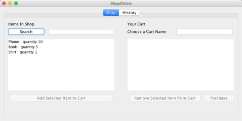

# OnlineShopSimulator

 

    

### Description

OnlineShopSimulator is a java program able to simulate the behavior of an online shop, where a customer can buy items and review past purchases. The project has been developed following TDD principles and using Gradle as build automation tool. CI, coverage and code quality were also taken into account linking the Git project repository to the online services of Travis, Coveralls and Sonarqube. A Dockerfile and a Jenkinsfile comes with the code to provide a portable continuous integration environment, in which is possible to reproduce the build we define thanks to a pipeline.

Link to whole paper [here](https://drive.google.com/file/d/1-01CTL-k6WWqx98tIsMKwPpJXTKMv4dG/view?usp=sharing).

### Dependencies

* Gradle
* Docker

### How to run Jenkins CI
From the Docker folder launch:

`docker build -t jenkins-pipeline .`

This command will build the container on which Jenkins will be instancieted with all its dependencies and the pipeline we defined. Then, to run it launch:

`docker run -it --rm --name jenkins-pipeline -p 8081:8080 -v /var/run/docker.sock:/var/run/docker.sock jenkins-pipeline`

Then, connecting to `localhost:8081` you will be redirect to Jenkins dashboard where you will find the "pipeline" job. Click on it and start the compilation.

### Launch the application
First of all launch a docker mongodb container with:

`docker run --rm --name mongo -p 27017:27017 mongo:4.0.5`

Then, from the root folder, run:

`cd OnlineShopSimulator`

`./gradlew clean fatJar`

`java -jar build/libs/OnlineShopSimulator.jar `
