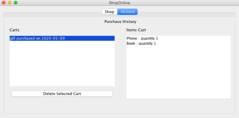

# OnlineShopSimulator

  

    

### Description

OnlineShopSimulator is a java program able to simulate the behavior of an online shop, where a customer can buy items and review past purchases. The project has been developed following TDD principles and using Gradle as build automation tool. CI, coverage and code quality were also taken into account linking the Git project repository to the online services of Travis, Coveralls and Sonarqube. A Dockerfile and a Jenkinsfile comes with the code to provide a portable continuous integration environment, in which is possible to reproduce the build we defined thanks to a pipeline.

Link to whole paper [here](https://drive.google.com/file/d/1-01CTL-k6WWqx98tIsMKwPpJXTKMv4dG/view?usp=sharing).

Below are shown two screenshots from the application: the first one is the store panel where a customer can add items to its cart and the purchase them. The second one, instead, is the history panel where it's possible to check past orders.

### Dependencies

* Gradle 5.6.1
* Docker 19.03.5
* Java

### How to run Jenkins CI

If you want to run Jenkins from Mac OS or Windows, skip the first step:

1. open a terminal and type `sudo iptables -A INPUT -i docker0 -j ACCEPT` ;

2. move to Docker folder and launch `docker build -t jenkins-pipeline .` : this command will build the container on which Jenkins will be instancieted with all its dependencies and the pipeline we defined. 

3. Then, to run it launch: 
`docker run -it --rm --name jenkins-pipeline -p 8081:8080 -v /var/run/docker.sock:/var/run/docker.sock jenkins-pipeline`

4. After the terminal prompts "Jenkins is fully up and running", connect to `localhost:8081` and you will be redirect to the Jenkins dashboard where you will find the "pipeline" job. Click on it and start the compilation.

### Launch the application

1. First of all launch a docker mongodb container with:

    - `docker run --rm --name mongo -p 27017:27017 mongo:4.0.5`

2. Then, from the root project folder:

    - `cd OnlineShopSimulator`

    - `./gradlew clean app`

    - `java -jar build/libs/OnlineShopSimulator.jar `
